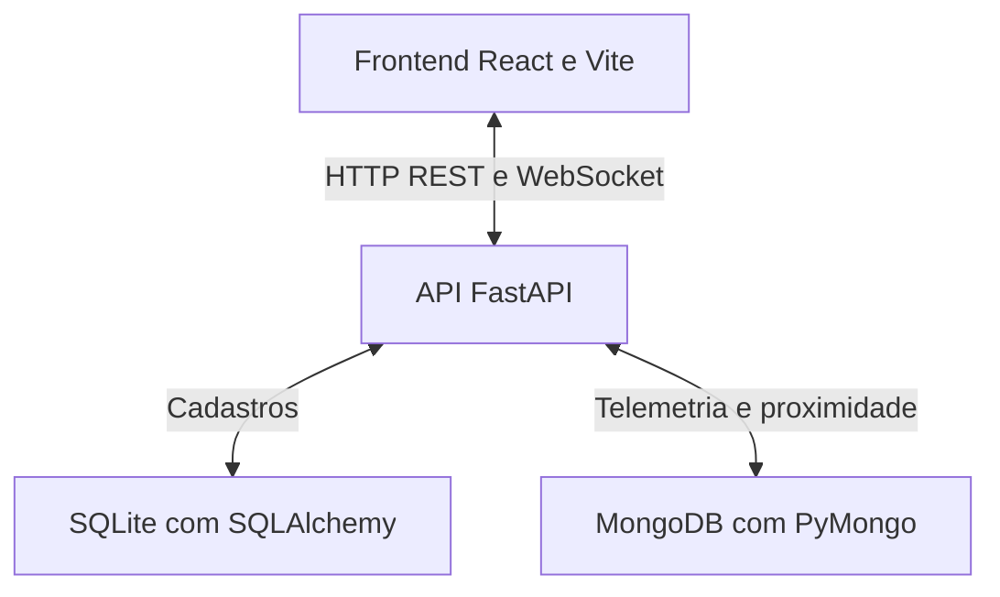

# GeoLog

Plataforma de monitoramento de frota desenvolvida para o Desafio Integrador de Persistência Poliglota da UNIPÊ. O sistema reúne cadastros de motoristas e veículos no SQLite e telemetria geoespacial no MongoDB, com uma interface React e uma API FastAPI.

## Funcionalidades

- Cadastro, listagem e consulta de motoristas e veículos.
- Registro de posição GPS, temperatura, velocidade e data de cada telemetria.
- Busca por raio no MongoDB a partir de pontos de referência em João Pessoa.
- Mapa com posições dos veículos e círculo da área de busca.
- Tabela unificada com motorista, placa, temperatura, velocidade e coordenadas.
- KPIs de frotas ativas, temperatura média e alertas acima de 80 km/h.
- Histórico de temperatura por veículo e distribuição do status dos motoristas.
- Simulação manual e automática de movimentação, a cada três segundos.
- Atualizações de telemetria por WebSocket.
- Suíte com 38 testes automatizados do backend.

## Tecnologias

| Camada | Tecnologias |
| --- | --- |
| Frontend | React, Vite e Axios |
| Mapa | React Leaflet, Leaflet e mapas do OpenStreetMap |
| Gráficos | Recharts |
| Backend | Python, FastAPI e Pydantic |
| Dados relacionais | SQLite e SQLAlchemy |
| Telemetria | MongoDB e PyMongo |
| Testes | pytest, HTTPX, TestClient e pytest-timeout |
| Execução em containers | Docker e Docker Compose |

## Arquitetura



O backend concentra o acesso aos dois bancos. Cada documento de telemetria guarda `veiculo_id`, que permite recuperar o veículo e o motorista no SQLite e montar uma resposta unificada em memória.

### Persistência relacional

| Tabela | Campos |
| --- | --- |
| `motoristas` | `id`, `nome`, `cnh`, `status` |
| `veiculos` | `id`, `placa`, `modelo`, `motorista_id` |

O banco padrão é `logitech.db`. CNH e placa têm restrições de unicidade nos modelos SQLAlchemy. A relação entre veículo e motorista usa `motorista_id`.

### Persistência documental

O MongoDB utiliza o banco `geolog` e a coleção `telemetrias`. A posição é armazenada como GeoJSON, sempre com **longitude antes da latitude**:

```javascript
{
  veiculo_id: 101,
  location: {
    type: "Point",
    coordinates: [-34.873, -7.115]
  },
  temperatura: 4.2,
  velocidade: 65,
  timestamp: ISODate("2026-09-11T10:00:00Z")
}
```

O backend cria os índices `location_2dsphere` e `veiculo_timestamp_desc` durante a inicialização. A consulta por raio usa `$geoNear`, seleciona a telemetria mais recente de cada veículo e só então filtra pela distância. Assim, uma posição antiga dentro da área não mantém um veículo que já saiu dela nos resultados.

## Estrutura do projeto

| Caminho | Responsabilidade |
| --- | --- |
| `backend/app/routers/` | Rotas HTTP e WebSocket |
| `backend/app/controllers/` | Coordenação das operações da API |
| `backend/app/services/` | Regras de serviço e distribuição de telemetria |
| `backend/app/repository/` | Interfaces e implementações de persistência |
| `backend/app/database/` | Inicialização de SQLite e MongoDB |
| `backend/app/models.py` | Modelos relacionais |
| `backend/seed.py` | Carga dos dados iniciais |
| `backend/tests/` | Testes automatizados |
| `frontend/src/` | Interface React, mapa, gráficos e integração com a API |
| `docker-compose.yml` | Serviços do sistema |
| `docker-compose.test.yml` | MongoDB separado e execução do pytest |
| `TESTES.md` | Guia detalhado dos testes |

## Executar o sistema com Docker

Requisito: Docker Desktop instalado e aberto, com Docker Compose disponível.

Use a pasta completa **GeoLog-frontend**, que contém `backend/`, `frontend/` e `docker-compose.yml`. Os comandos abaixo são para o **CMD do Windows**, executados nessa pasta.

### 1. Conferir o caminho do frontend

No `docker-compose.yml` enviado originalmente, corrija o caminho `./frotend/.env` para `./frontend/.env`, caso ainda esteja com esse erro:

```yaml
env_file:
  - ./frontend/.env
```

### 2. Criar os arquivos de configuração

Na primeira configuração, execute:

```cmd
copy backend\.env.example .env
copy backend\.env.example backend\.env
```

O `frontend/.env` já acompanha o projeto. Se estiver ausente, crie a partir do exemplo:

```cmd
copy frontend\.env.exemple frontend\.env
```

O arquivo da raiz precisa definir as variáveis usadas pelo Compose:

```env
DATABASE_URL=sqlite:///./logitech.db
MONGO_HOST=mongodb
MONGO_PORT=27017
MONGO_DB=geolog
```

Para o frontend:

```env
VITE_API_URL=http://localhost:8000
```

No PowerShell, utilize `Copy-Item` em vez de `copy`; no Linux/macOS, utilize `cp`.

### 3. Iniciar os serviços

```cmd
docker compose up --build
```

Na primeira execução, aguarde o download das imagens e a instalação das dependências. Deixe o terminal aberto enquanto estiver usando o sistema.

**Carga inicial:** o comando de inicialização do backend executa `python seed.py` antes da API. Esse script apaga os cadastros e as telemetrias existentes e repõe os dados iniciais. Isso também ocorre nas próximas inicializações do container do backend; utilize essa configuração como ambiente de demonstração.

### 4. Acessar

| Serviço | Endereço |
| --- | --- |
| Sistema | [http://localhost:5173](http://localhost:5173) |
| Documentação da API | [http://localhost:8000/docs](http://localhost:8000/docs) |
| Health | [http://localhost:8000/health](http://localhost:8000/health) |

O health retorna:

```json
{"status": "ok", "service": "backend"}
```

### 5. Encerrar

Pressione `Ctrl+C` no terminal e execute:

```cmd
docker compose down
```

## Executar Python e frontend localmente

Para executar sem os containers de aplicação, utilize Python 3.12, MongoDB e Node.js compatível com o Vite do projeto. O arquivo de dependências do frontend exige **Node.js 20.19 ou superior na linha 20, ou 22.12 ou superior**.

### 1. Iniciar um MongoDB local

Se já existir MongoDB em `localhost:27017`, utilize esse servidor. Caso contrário, execute:

```cmd
docker run -d --name geolog-mongo-local -p 127.0.0.1:27017:27017 mongo:7
```

### 2. Iniciar o backend

Abra um terminal na raiz do projeto:

```cmd
cd backend
py -m venv .venv
.venv\Scripts\python.exe -m pip install -r requirements.txt
set DATABASE_URL=sqlite:///./logitech.db
set MONGODB_URI=mongodb://127.0.0.1:27017/geolog
.venv\Scripts\python.exe seed.py
.venv\Scripts\python.exe -m uvicorn app.main:app --reload
```

As variáveis definidas com `set` valem para esse terminal e têm prioridade sobre o `.env`. O hostname do MongoDB é `127.0.0.1` nesta execução; `mongodb` e `geolog-mongodb` são nomes usados na rede Docker.

Execute `seed.py` apenas quando desejar repor os dados iniciais, pois ele apaga os dados existentes. Nas próximas execuções locais, basta configurar as variáveis e iniciar o Uvicorn.

### 3. Iniciar o frontend

Abra outro terminal na raiz do projeto:

```cmd
cd frontend
npm ci
npm run dev
```

Confira se `frontend/.env` define `VITE_API_URL=http://localhost:8000`. Acesse o endereço exibido pelo Vite, normalmente [http://localhost:5173](http://localhost:5173).

## Testes automatizados

### Executar tudo com Docker

Na raiz do projeto:

```cmd
docker compose -f docker-compose.test.yml up --abort-on-container-exit --exit-code-from tests
```

O Compose de testes inicia um MongoDB separado, instala as dependências e executa `python -m pytest -v`. Não é necessário iniciar o frontend, iniciar a API externamente ou rodar `seed.py`.

Depois:

```cmd
docker compose -f docker-compose.test.yml down
```

### Executar pytest diretamente

Inicie somente o MongoDB de testes, na raiz:

```cmd
docker compose -f docker-compose.test.yml up -d --wait mongo-test
```

Dentro de `backend/`, com o ambiente virtual criado:

```cmd
.venv\Scripts\python.exe -m pip install -r requirements-test.txt
.venv\Scripts\python.exe -m pytest -v
```

Por padrão, os testes conectam em `mongodb://127.0.0.1:27018`. Para outro servidor, defina a variável exclusiva dos testes:

```cmd
set TEST_MONGODB_URI=mongodb://127.0.0.1:27017
.venv\Scripts\python.exe -m pytest -v
```

Cada teste de integração cria um SQLite temporário e um banco MongoDB `geolog_pytest_<uuid>`. O encerramento remove exclusivamente o banco criado para aquele teste. As configurações normais `DATABASE_URL` e `MONGODB_URI` são substituídas durante os testes.

### Cobertura dos cenários

| Grupo | Quantidade | Verificações principais |
| --- | ---: | --- |
| API e SQLite | 17 | Health, cadastros, associações, persistência e erros 404/422 |
| Geoespacial | 8 | Raios 0/1/5/10 km, área vazia e uso da posição mais recente |
| Telemetria | 8 | Join poliglota, GeoJSON, data BSON e índices |
| WebSocket | 3 | Envio com timestamp, filtro por raio e desconexão |
| Distância | 2 | Distância zero e cálculo em quilômetros |
| **Total** | **38** | **Todos aprovados na validação de 01/10/2026** |

A validação utilizou Python 3.12.14, pytest 8.3.5 e MongoDB real 7.0.16, diretamente pelo Python. Os comandos Docker estão configurados no projeto, mas não foram executados no ambiente dessa validação. A suíte cobre o backend; a interface React requer conferência visual complementar.

Consulte [TESTES.md](TESTES.md) para executar arquivos específicos ou apenas os testes que dispensam MongoDB.

## Conferência visual

Antes de simular, com o seed inicial:

| Indicador | Resultado esperado |
| --- | --- |
| Veículos na visão unificada | 3 |
| Frotas ativas | 2 |
| Temperatura média | Aproximadamente 2,6 °C |
| Alertas acima de 80 km/h | 1 |
| Status dos motoristas | 2 Ativo e 1 Em Descanso |

Com a referência **Centro de João Pessoa**, a busca deve retornar:

| Raio | Veículos dentro da área |
| --- | --- |
| 1 km | ABC-1A23 |
| 5 km | ABC-1A23 e XYZ-9876 |
| 10 km | ABC-1A23, XYZ-9876 e KGB-4567 |

Clique em **Simular Movimentação** e confira novas posições e medições na tabela, no mapa e no histórico. O indicador **ao vivo** sinaliza que a conexão WebSocket foi aberta. Após simular, os valores e os veículos dentro do raio podem mudar.

## Rotas principais

| Método | Rota | Finalidade |
| --- | --- | --- |
| GET | `/health` | Health da aplicação |
| GET / POST | `/api/v1/motoristas` | Listar ou criar motoristas |
| GET | `/api/v1/motoristas/{id}` | Buscar motorista |
| GET / POST | `/api/v1/veiculos` | Listar ou criar veículos |
| GET | `/api/v1/veiculos/{id}` | Buscar veículo |
| GET | `/api/v1/veiculos/motorista/{id}` | Listar veículos de um motorista |
| GET | `/api/v1/veiculos/proximos` | Buscar últimas posições dentro de um raio |
| GET / POST | `/api/v1/telemetrias` | Listar ou registrar telemetrias |
| WebSocket | `/api/v1/telemetrias/ws?socket_id=<identificador>` | Receber novas telemetrias |

A busca por proximidade exige `latitude`, `longitude`, `raio` e `socket_id`. O identificador deve corresponder a uma conexão WebSocket aberta. O frontend gerencia esse vínculo automaticamente.

Exemplo do corpo de `POST /api/v1/telemetrias`:

```json
{
  "veiculo_id": 101,
  "location": {
    "latitude": -7.116,
    "longitude": -34.874
  },
  "temperatura": 5.5,
  "velocidade": 70,
  "timestamp": "2026-10-01T22:00:00Z"
}
```

## Problemas comuns

| Situação | Como resolver |
| --- | --- |
| `backend/.env not found` | Criar `backend/.env` a partir de `backend/.env.example`. |
| Avisos de `MONGO_DB`, `MONGO_HOST`, `MONGO_PORT` ou `DATABASE_URL` vazios | Criar o `.env` da raiz copiando `backend/.env.example`. |
| Caminho `frotend/.env` não encontrado | Corrigir para `frontend/.env` no Compose. |
| Porta 27017, 8000 ou 5173 ocupada | Encerrar o serviço que já usa essa porta antes de iniciar outro. |
| Interface não carrega os dados | Conferir a API em `/health`, `VITE_API_URL` e os logs do backend. |
| Falha ao carregar o mapa de fundo | Conferir acesso aos tiles do OpenStreetMap; o mapa depende desse serviço externo. |
| `MongoDB de testes indisponivel` | Iniciar `mongo-test` ou ajustar `TEST_MONGODB_URI`. |
| Mensagem sobre `version` obsoleto no Compose | É um aviso; o atributo pode ser removido do YAML. |

Para consultar os logs do sistema:

```cmd
docker compose logs --tail 100 backend
docker compose logs --tail 100 frontend
docker compose logs --tail 100 mongodb
```
